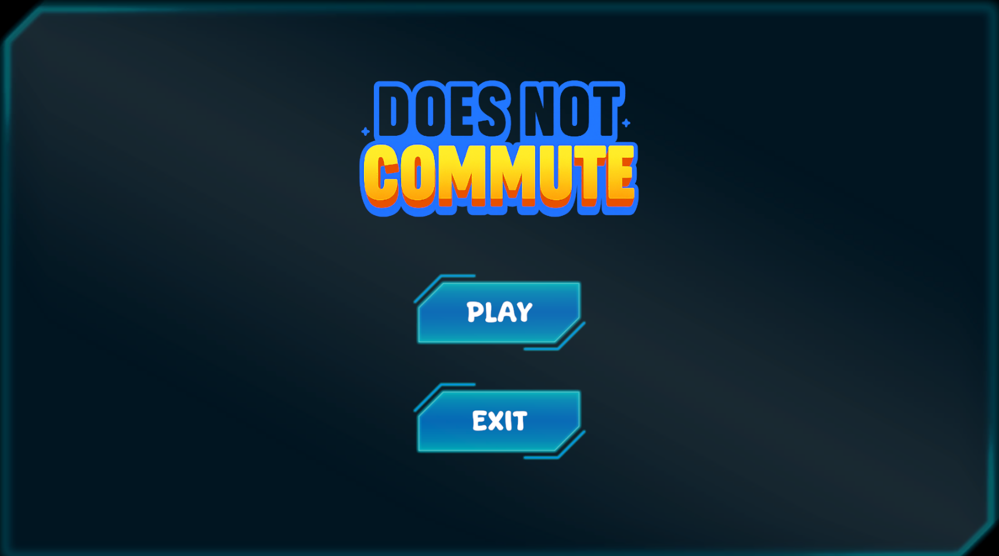
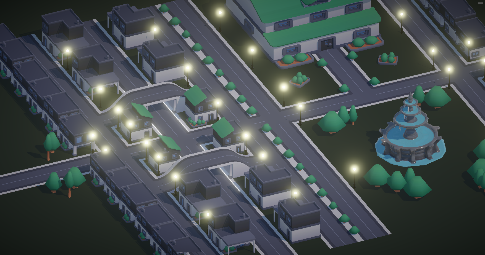
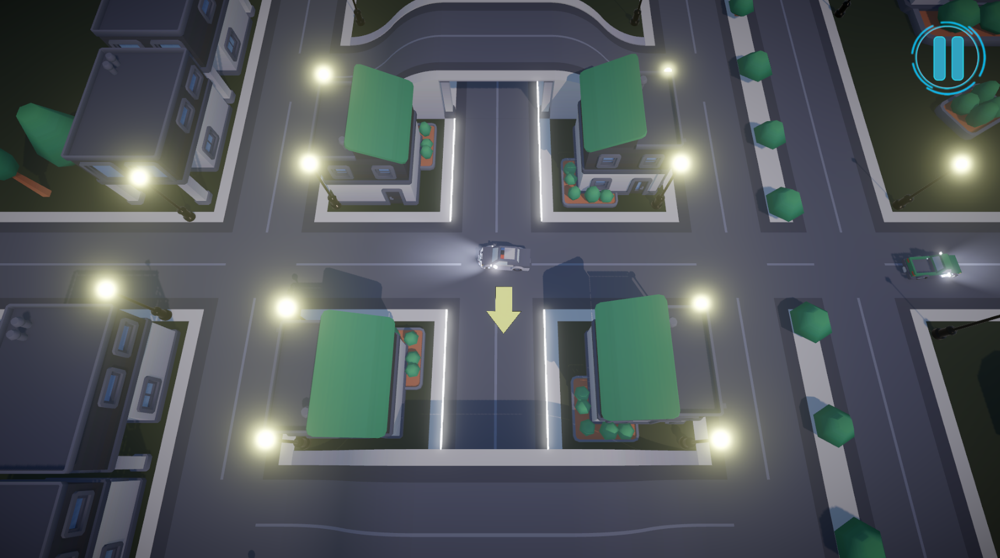
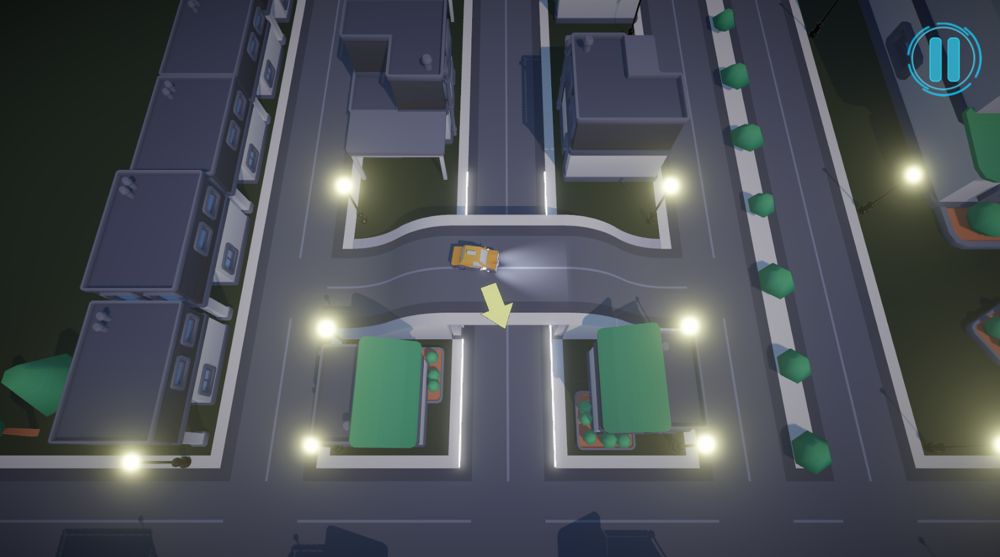

# 🚗 Does Not Commute Clone

A Unity-made clone of the brilliant game **Does Not Commute**, originally created by Mediocre. This is a strategic driving game where you must plan the routes of multiple vehicles on a small map — and every move affects the next.

> "What if time was not on your side... and neither were the other drivers?"

---

## 🎮 Gameplay

In this game, you control a series of cars, one at a time. Each car needs to reach its destination — but the twist is: all previous cars remain on the map and follow the paths you've already driven. As the level progresses, it becomes increasingly difficult to avoid collisions.

🧠 Think fast, plan carefully, and adapt to the chaos!

<!-- Replace the link below with your actual gameplay GIF or screenshot -->


---

## 🛠️ Built With

- **Unity** (URP)
- Rewindable timeline mechanic

---

## 📷 Screenshots

<!-- Replace these links with your actual image files in the repository -->

### Main Menu  


### Gameplay  


### Gameplay  


### Gameplay  


---

## 🧩 Features

- ⏪ Rewind-style gameplay with persistent vehicle paths  
- 🚧 Dynamic traffic

---

## 📦 Installation

1. Clone this repository:
   ```bash
   git clone https://github.com/SedanurYesilnacar/DoesNotCommuteClone.git
2. Open the project in Unity 2022.3 LTS or later.
3. Press Play to start testing the game.

## 🖼️ Credits
Inspired by: Does Not Commute by Mediocre

Made with ❤️ by Swanthie
